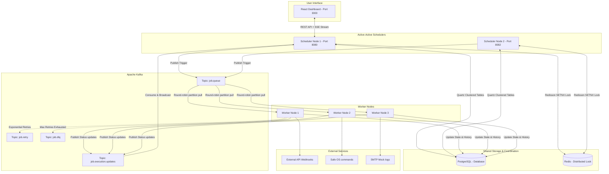

# Production-Grade Distributed Job Scheduler

A complete, resume-ready **Distributed Job Scheduler** designed for high throughput, fault tolerance, and zero duplicate executions. The system is split into an active-active scheduling layer (`scheduler-service`) and a horizontally scalable execution layer (`worker-service`).

---

## System Architecture



---

## Technology Stack

- **Backend core**: Spring Boot 3.2.4 (Java 17)
- **Database**: PostgreSQL 15 (Stores job rules, execution logs, and Quartz clustered metadata)
- **Distributed Cache & Locking**: Redis 7 + Redisson (Distributed `RLock` synchronization)
- **Distributed Queue**: Apache Kafka (Handles workload dispatch, retries, and DLQ routing)
- **Trigger Engine**: Quartz Scheduler (JDBC Clustered Mode)
- **Frontend Dashboard**: React + Vite + CSS Modules + Lucide icons (Real-time live monitoring via SSE)
- **Security**: JWT Authentication + whitelisted execution controls

---

## Core System Design Features

### 1. Quartz JDBC Clustering
Instead of using in-memory triggers that fire concurrently on each server instance, we configure Quartz with `spring.quartz.job-store-type=jdbc` and enable `org.quartz.jobStore.isClustered=true`. Triggers are persisted in PostgreSQL, and nodes negotiate locks using the database to guarantee that only one scheduler node triggers a job fire.

### 2. Double Safety Distributed Lock (Redisson)
Even with database clustering, minor clock drift or network anomalies can cause Quartz to fire duplicate triggers. We implement a secondary lock layer: before pushing the event to Kafka, the scheduling node must acquire a Redis lock using `SETNX` through Redisson. If the lock is held, the execution is skipped as a duplicate.

### 3. Horizontally Scalable Workers (Kafka Queue)
Jobs are pushed to the Kafka `job.queue` topic. Since the topic has 3 partitions and we deploy 3 worker nodes, Kafka handles automatic load distribution. Workers operate statelessly: they pull triggers, run the payload (`HTTP_CALL`, `SHELL`, or `EMAIL`), and write results to the shared database.

### 4. Exponential Backoff Failover Routing
When a task fails (e.g., target server is down), the worker service catches the exception. If the retry count is below the configured max retries, it publishes to `job.retry`. The retry listener calculates a delay using:
`Delay = 2^(Retry Count) * 1000 ms`
After sleeping for this delay, the task is re-run. If it fails repeatedly and max retries are exhausted, it routes to `job.dlq` (Dead Letter Queue).

### 5. Server-Sent Events (SSE) Live Feed
Rather than polluting the database with constant API polling, the React UI connects to `GET /api/executions/stream`. When workers finish execution, they push a message to Kafka's `job.execution.updates` topic. The scheduler service consumes the message and forwards it via SSE to all connected clients.

---

## Getting Started

### Prerequisites
- Docker and Docker Compose installed.

### Quick Start Commands
1. **Clone and Run**:
   ```bash
   docker compose up --build -d
   ```
2. **Access the Dashboard**:
   - Open your browser and navigate to `http://localhost:3000`.
3. **Login Details**:
   - **Username**: `admin`
   - **Password**: `admin123`

---

## Interview & Resume Talking Points

### 1. Typical Interview Q&A

#### Q: Why do you need Redis Locks if Quartz is already configured for JDBC Clustering?
> **Answer**: Database-backed clustering in Quartz operates on transaction isolation levels and polling intervals (often several seconds). Under heavy load, clock drifts, or database transaction locks, multiple schedulers can fetch the same trigger record simultaneously. Integrating Redisson distributed locks creates a lightweight, sub-millisecond memory lock check that acts as a double safety layer.

#### Q: How did you implement atomic transactions in the Worker Service?
> **Answer**: The worker executes inside a Spring `@Transactional` wrapper. The execution log is updated to `RUNNING` in PostgreSQL. When the execution completes (or fails), the status write to the database and any Kafka retry notifications are executed in the same transaction. If the database transaction fails, the Kafka broker offset commit rolls back, preventing lost messages.

#### Q: What are the security risks of the Shell Executor and how did you resolve them?
> **Answer**: Executing shell commands via Java's `ProcessBuilder` is prone to shell injection attacks. To prevent this, we enforce three layers of security:
> 1. **Whitelist Sanitization**: Commands must match a strict regex filter: `^[a-zA-Z0-9\s\-_/\.:=?&]+$`, blocking shell metacharacters like `;`, `&`, `|`, `$` or `>`.
> 2. **Type Locking**: Users cannot update a job's type from HTTP to Shell after creation.
> 3. **Non-Root Execution**: In Docker, the worker runs under a limited, non-privileged system user account, locking down system-level access.

#### Q: How does the DLQ Requeue feature work?
> **Answer**: When a task lands in the DLQ, it is flagged as failed. In the frontend DLQ Manager, operators can inspect the failure stack trace and click **"Requeue Task"**. This dispatches the task back to the active `job.queue` with its retry count reset to 0, leaving the original Quartz cron trigger untouched.

---

### 2. Live Demo Script (For Interviews)

#### Step 1: Distributed Load Balancing
Verify that Quartz schedules tasks to one node and Kafka distributes executions across workers:
```bash
# Check scheduler logs (only one node triggers the job)
docker logs -f scheduler-service
docker logs -f scheduler-service-2

# Observe worker logs (executions are distributed)
docker logs -f worker-1
docker logs -f worker-2
docker logs -f worker-3
```

#### Step 2: Retry with Exponential Backoff
1. In the React UI, create an `HTTP_CALL` job targeting an invalid URL (e.g. `https://invalid-host-abc-123.com`).
2. Watch the logs. You will see:
   - **Attempt 1**: Fails. Published to `job.retry`.
   - **Attempt 2**: Runs after a 2-second backoff delay. Fails.
   - **Attempt 3**: Runs after a 4-second backoff delay. Fails.
   - **Attempt 4**: Runs after an 8-second backoff delay. Fails.
   - **DLQ Routing**: Retries exhausted. Job is routed to DLQ.
