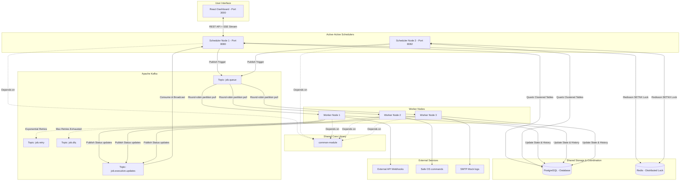

# Enterprise-Grade Distributed Job Scheduler (Monorepo)

A production-grade, highly resilient **Distributed Job Scheduler** designed for high throughput, fault tolerance, and zero duplicate executions. The system is architected as a Maven monorepo, separating shared data models from an active-active scheduling plane (`scheduler-service`) and a horizontally scalable execution plane (`worker-service`).

---

## System Architecture



---

## Project Structure

This monorepo uses Maven to coordinate dependencies and build lifecycle stages:

```
├── common-module/              # Shared core module containing reusable domain logic
│   ├── pom.xml
│   └── src/main/java/com/naveenmandal/common/
│       ├── model/              # Database entities (Job, JobExecution, enums)
│       ├── event/              # Event messaging objects (JobEvent)
│       └── repository/         # Spring Data JPA repositories
├── scheduler-service/          # Control Plane: JWT auth, REST APIs, Quartz clustering
│   ├── Dockerfile
│   ├── pom.xml
│   └── src/main/java/com/naveenmandal/scheduler/
├── worker-service/             # Execution Plane: Kafka consumers & execution executors
│   ├── Dockerfile
│   ├── pom.xml
│   └── src/main/java/com/naveenmandal/worker/
│       └── service/            # JobWorkerService (Listeners) & JobExecutionHandler (Transactional)
├── frontend/                   # React Frontend built with Vite & served via Nginx
├── docker-compose.yml          # Local orchestration setup for all microservices
└── pom.xml                     # Monorepo root pom.xml (module registry)
```

---

## Core System Design Features

### 1. Quartz JDBC Clustering
Quartz is configured with `spring.quartz.job-store-type=jdbc` and `org.quartz.jobStore.isClustered=true`. Trigger locks are persisted in PostgreSQL, preventing active-active scheduler instances from triggering concurrent duplicate fires.

### 2. Double Safety Distributed Lock (Redisson)
> [!NOTE]
> Database clustering can experience clock drift or database lock transaction delays under peak loads. 
> To prevent duplicate executions, we implement a secondary in-memory lock check using Redisson's distributed `RLock`. The node must acquire this sub-millisecond key before submitting a task to Kafka; otherwise, the execution is skipped as a duplicate.

### 3. Kafka Queue Worker Load Balancing
Triggers are enqueued to the Kafka `job.queue` topic. Using partition keying, workloads are automatically distributed round-robin among stateless workers. 

### 4. Non-Blocking Exponential Backoff & DLQ Routing
When a task execution fails, the worker intercepts the exception. If the retry count is within boundaries, the worker schedules a retry on `job.retry`. 
- **Backoff Formula**: `Delay = 2^(Retry Count) * 1000 ms`
- Sleep delays are run **outside** transactional boundaries to avoid blocking DB connection pools.
- If all retries are exhausted, the event is routed to `job.dlq` (Dead Letter Queue).

### 5. Server-Sent Events (SSE) Live Feed
Dashboard telemetry avoids continuous REST API polling. Telemetry updates are pushed by workers to `job.execution.updates`, consumed by the control plane, and streamed live to connected browsers using SSE (`/api/executions/stream`).

---

## Getting Started

### Prerequisites
- Docker and Docker Compose installed.
- Java 17 and Maven (optional, required for local IDE compilation).

### Local IDE Compilation Setup
To populate your host's local `.m2` repository and prevent dependency import errors in your editor:
```bash
mvn clean install -DskipTests
```

### Docker Quick Start
1. **Build and Run Containers**:
   ```bash
   docker compose up --build -d
   ```
2. **Access the Web Dashboard**:
   - Open `http://localhost:3000`.
3. **Seed Credentials**:
   - **Username**: `admin`
   - **Password**: `admin123`

---

## Interview & Resume Talking Points

### 1. Architectural Highlights

#### Q: How does transaction demarcation work during worker execution?
> **Answer**: All database state writes and subsequent message routing (retry/DLQ dispatch) occur inside an atomic `@Transactional` boundary inside `JobExecutionHandler`. However, the exponential backoff sleep delay is executed in `JobWorkerService` **outside** the transaction. This prevents holding open database connections during thread sleeps, eliminating connection pool exhaustion issues.

#### Q: Why did you split JobWorkerService and JobExecutionHandler?
> **Answer**: Spring's `@Transactional` annotation relies on AOP proxies. Calling a `@Transactional` method internally from within the same class bypasses the proxy, failing to start a transaction. Rather than using smelly code turnarounds (like `@Lazy self-injection`), we cleanly segregated concerns: `JobWorkerService` handles listener consumption and thread sleeps, while `JobExecutionHandler` handles transactional database writes.

#### Q: What security practices did you enforce?
> **Answer**: 
> 1. **Docker Container Hardening**: Modified execution stages in both service Dockerfiles to compile and run using a non-root system user (`appuser`), minimizing host takeover risks.
> 2. **Shell Injection Prevention**: Restrict OS command triggers using a whitelisted regex: `^[a-zA-Z0-9\s\-_/\.:=?&]+$`, blocking metacharacters like `;`, `&`, `|`, or `$`.
> 3. **Input Validation**: Configured Hibernate constraints (`@NotBlank`, `@Min`, `@Max`, `@Size`) on incoming REST API requests using the Spring validation starter.

---

## Live Demo Verification Script

### Step 1: Monitor Clustered Log Outputs
Open terminal tabs to verify load distribution and clustering safety:
```bash
# Check scheduler logs (only one node triggers the job)
docker logs -f scheduler-service
docker logs -f scheduler-service-2

# Observe worker logs (executions are distributed)
docker logs -f worker-1
docker logs -f worker-2
docker logs -f worker-3
```

### Step 2: Test Backoff Failures
1. Create an `HTTP_CALL` trigger in the web dashboard targeting a nonexistent URL (e.g. `https://broken-api-endpoint.com`).
2. Monitor worker console feeds. You will witness:
   - **Attempt 1**: Fails, enqueues to `job.retry`.
   - **Attempt 2**: Sleep 2s -> Fails.
   - **Attempt 3**: Sleep 4s -> Fails.
   - **Attempt 4**: Sleep 8s -> Fails.
   - **DLQ Enqueue**: Forwarded to dead letter queue.
